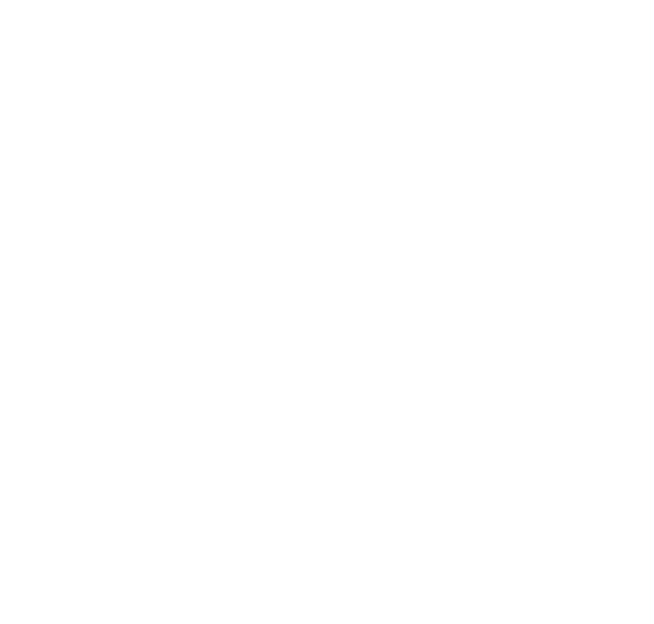

<!--
 * This file is part of davidllamasroman.com.
 *
 * davidllamasroman.com is free software: you can redistribute it and/or modify
 * it under the terms of the GNU General Public License as published by
 * the Free Software Foundation, version 3 of the License only.
 *
 * davidllamasroman.com is distributed in the hope that it will be useful,
 * but WITHOUT ANY WARRANTY; without even the implied warranty of
 * MERCHANTABILITY or FITNESS FOR A PARTICULAR PURPOSE. See the
 * GNU General Public License for more details.
 *
 * You should have received a copy of the GNU General Public License
 * along with davidllamasroman.com. If not, see <https://www.gnu.org/licenses/gpl-3.0.en.html>.
 *
 * Copyright (C) 2024 David Llamas Román
-->

# davidllamasroman.com
This is my personal website where you can find my projects, my laboral experience and all information about me that I consider is relevant.

- [davidllamasroman.com](#davidllamasromancom)
  - [💻 More details about website](#-more-details-about-website)
    - [Website Type](#website-type)
    - [Sections](#sections)
    - [📁 Database](#-database)
      - [Conceptual design](#conceptual-design)
      - [Logical design](#logical-design)
      - [Physical design](#physical-design)
    - [⚙ Backend](#-backend)
      - [API](#api)
        - [Login](#login)
          - [Sign up \& Sign in](#sign-up--sign-in)
        - [Projects](#projects)
        - [Experience](#experience)
        - [Blog](#blog)
        - [Academy](#academy)
    - [UX](#ux)
      - [Pages structure](#pages-structure)
        - [Header](#header)
        - [Footer](#footer)
        - [Main content](#main-content)
    - [UI](#ui)
      - [Logo](#logo)
      - [Fonts](#fonts)
      - [Brand colors](#brand-colors)
  - [🛠️ Technologies](#️-technologies)
    - [💄 Frontend](#-frontend)
    - [⚙️ Backend](#️-backend)
      - [RDBMS](#rdbms)
      - [ORM](#orm)
      - [API](#api-1)
    - [✏️ Linters](#️-linters)
  - [🌐 Languages](#-languages)
    - [Website](#website)
    - [Documentation](#documentation)
    - [Courses](#courses)
  - [📚 Courses in Markdown](#-courses-in-markdown)
    - [Markup Languages](#markup-languages)
    - [Styles](#styles)
    - [Programming Languages](#programming-languages)
    - [Databases](#databases)
      - [Relational databases](#relational-databases)
  - [👨‍⚖️ Licenses](#️-licenses)


## 💻 More details about website
### Website Type
- **Web App**

  This is a web app, because we have a database in it and we have an API with which we can access and manage the database data. Then, the data we extract through the API is displayed in the frontend. If the main objective of the website is to attract clients and we do not need any database, any API (because we search, for example, redirect to an external app), the website type will be 'Landing Page'.

<p align=right><a href="#davidllamasromancom"><strong>Go up ⬆</strong></a></p>

### Sections
- **Home**
  In this section, it will show an 'intro' and some links to see one section or other.

- **About me**
  In this section, it will show a text that have as main objective introduce myself and help to people to meet me better.
  
  - **Projects**
    In this section, it will show all my projects and relevant info about them.

  - **Experience**
    In this section, it will show all jobs and work positions that I have been.

- **Blog**

- **Academy**
  In this section you would find some free courses about technologies in which I have a good level. The videos will be uploaded in YouTube and, here, will be the text version of course and the video embedded.

- **Get in touch**
  In this section you will find a chat to talk with me, but do not by any reason. Only, for example, if you want to tell me something about a work issue, about a side or personal project that you have, about my content... I think that you understand the type of messages that I expect to receive.

- **Licenses**
  In this section, it will show all licenses under which the website and its content are licensed.

<p align=right><a href="#davidllamasromancom"><strong>Go up ⬆</strong></a></p>

### 📁 Database
#### Conceptual design
Features:
- There are 'users' and 'account'.
  - 1 user can only create 1 account.
  - 1 account can only be created by 1 user.
  - Each user can manage his account.
    - Each user can delete his account (less the administrators).
    - Each user can desactive his account.
  - Each user has 1 role.
    - Administrator.
      - The account of the user whose role is this will be 'administrator account'.
        - With the administrator account you can:
          - Personalize the website:
            - Change the logo.
            - Change fonts.
            - Change header links.
            - Change footer text.
          - About me:
            - Change this section text.
            - Projects:
              - Create a project.
              - Manage any project.
                - Edit.
                - Delete.
            - Experience:
              - Create a job position.
              - Manage any job position.
                - Edit.
                - Delete.
          - Blog:
            - Create a section.
            - Create an article.
            - Manage any section or any article.
              - Edit.
              - Delete.
            - Each article can has a unlimited number of comments.
              - Delete any comment.
              - Pin a comment.
          - Academy:
            - Create a learning path.
            - Manage any learning path.
              - Add or remove courses.
              - Edit.
              - Delete.
            - Create a course.
            - Manage any course.
              - Create a course version.
              - Manage any course version.
                - Edit.
                - Delete.
              - Enable and disable any course forum.
              - Delete any message of any course forum.
              - Expel any user from any course forum.
              - Create exercises.
              - Manage exercises.
                - Edit.
                - Delete.
              - Create exams.
              - Manage exams.
                - Edit.
                - Delete.
          - Get in touch:
            - Block and unblock any user.
          - Licenses:
            - Create a license notice.
            - Manage any license notice.
              - Edit.
              - Delete.
    - Normal.
      - The account of the user whose role is this will be 'normal account'.
        - About Me:
          - Viewer.
          - Projects:
            - Viewer.
          - Experience:
            - Viewer.
        - Blog:
          - Viewer.
          - Comment in any post.
        - Academy:
          - Student.
        - Get in touch:
          - Chat with the administrator.
        - Licenses:
          - Viewer.

#### Logical design
#### Physical design

<p align=right><a href="#davidllamasromancom"><strong>Go up ⬆</strong></a></p>

### ⚙ Backend
#### API
##### Login
###### Sign up & Sign in
##### Projects
##### Experience
##### Blog
##### Academy

### UX
#### Pages structure
##### Header
On all pages, we can find a header with links that allow us to switch between the different sections.

##### Footer
On all pages, we can find a footer with only a copyright notice.

##### Main content

### UI
#### Logo
<p align="center"></p>

The logo reflects my evolution both professionally and personally.
- The squares that form the 3 steps of the staircase represent the plan I have always followed to become who I am today. This figure is typically associated with acting thoughtfully and analyzing the situation carefully.
- The staircase symbolizes my growth in the profesional field. It is normally related with the progress and development.
- The fonts used for the acronym (DLR - David Llamas Román) are different to represent my personal evolution and the changes in my mindset over time.

#### Fonts

#### Brand colors

<p align=right><a href="#davidllamasromancom"><strong>Go up ⬆</strong></a></p>

## 🛠️ Technologies
### 💄 Frontend
- HTML
- CSS
- Vanilla JS

### ⚙️ Backend
#### RDBMS
- [MariaDB](https://mariadb.org/)

#### ORM
- [Sequelize](https://sequelize.org/)

#### API
- [Node.js](https://nodejs.org/)

### ✏️ Linters
- [Prettier](https://prettier.io/)
- [Eslint](https://eslint.org/)
  ```
  npm init @eslint/config@latest
  ```

<p align=right><a href="#davidllamasromancom"><strong>Go up ⬆</strong></a></p>

## 🌐 Languages
### Website
- English
- Spanish

### Documentation
- English

### Courses
- Spanish

<p align=right><a href="#davidllamasromancom"><strong>Go up ⬆</strong></a></p>

## 📚 Courses in Markdown
### Markup Languages
- [**XML (v0)**](./backend/data/courses/markupLanguages/xml/v0/xml.md)
- [**HTML (v0)**](./backend/data/courses/markupLanguages/html/v0/html.md)

### Styles
- [**CSS (v0)**](./backend/data/courses/styles/css/v0/css.md)

### Programming Languages
- [**Java (v0)**](./backend/data/courses/programmingLanguages/java/v0/java.md)
- [**JavaScript (v0)**](./backend/data/courses/programmingLanguages/js/v0/js.md)

### Databases
#### Relational databases
- [**SQL (v0)**](./backend/data/courses/databases/relationalDatabases/sql/v0/sql.md)

<p align=right><a href="#davidllamasromancom"><strong>Go up ⬆</strong></a></p>

## 👨‍⚖️ Licenses
&copy; 2024 David Llamas Román. Licensed under the [GNU General Public License version 3 (GPL-3.0) only](https://www.gnu.org/licenses/gpl-3.0.en.html)

> [!WARNING]
> This file is part of davidllamasroman.com.
>
> davidllamasroman.com is free software: you can redistribute it and/or modify
> it under the terms of the GNU General Public License as published by
> the Free Software Foundation, version 3 of the License only.
>
> davidllamasroman.com is distributed in the hope that it will be useful,
> but WITHOUT ANY WARRANTY; without even the implied warranty of
> MERCHANTABILITY or FITNESS FOR A PARTICULAR PURPOSE. See the
> GNU General Public License for more details.
>
> You should have received a copy of the GNU General Public License
> along with davidllamasroman.com. If not, see <https://www.gnu.org/licenses/gpl-3.0.en.html>.
>
> Copyright (C) 2024 David Llamas Román

This warning appears in all files of the davidllamasroman.com project that contain code. JSON files are exempt from this warning because they do not support comments.

In the second paragraph (lines 7–10 of the WARNING), we explicitly state that the project is licensed under the terms of **version 3 of the GNU General Public License only**, as defined in point 15 of the [GPL-3.0-only license](./LICENSE):
```
15. Disclaimer of Warranty.

  THERE IS NO WARRANTY FOR THE PROGRAM, TO THE EXTENT PERMITTED BY
APPLICABLE LAW.  EXCEPT WHEN OTHERWISE STATED IN WRITING THE COPYRIGHT
HOLDERS AND/OR OTHER PARTIES PROVIDE THE PROGRAM "AS IS" WITHOUT WARRANTY
OF ANY KIND, EITHER EXPRESSED OR IMPLIED, INCLUDING, BUT NOT LIMITED TO,
THE IMPLIED WARRANTIES OF MERCHANTABILITY AND FITNESS FOR A PARTICULAR
PURPOSE.  THE ENTIRE RISK AS TO THE QUALITY AND PERFORMANCE OF THE PROGRAM
IS WITH YOU.  SHOULD THE PROGRAM PROVE DEFECTIVE, YOU ASSUME THE COST OF
ALL NECESSARY SERVICING, REPAIR OR CORRECTION.
```

<p align=right><a href="#davidllamasromancom"><strong>Go up ⬆</strong></a></p>